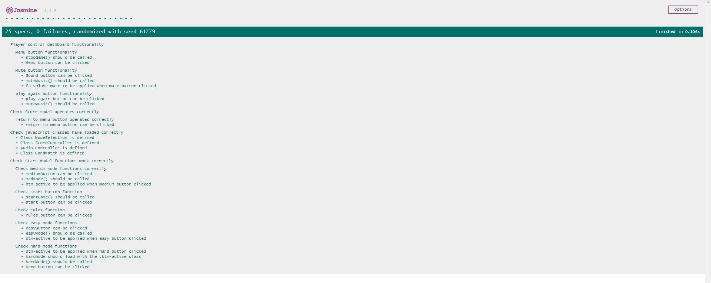

<h1>Testing</h1>

In this document I am going to illustrate the various tests that I have performed on my code to ensure that it is functional and meets required web standards.

<h2>Automated Testing</h2>

<h3>Validation</h3>

In order to ensure my code has met the various web standards, I have used the following validation services to test different elements of my code. 

<ul>
    <li><a href=”https://validator.w3.org/” target="_blank">W3C Markup Validation</a> was used to validate HTML code.</li>
    <li><a href=”https://jigsaw.w3.org/css-validator/” target="_blank">W3C CSS Validation</a> was used to validate CSS code.</li>
    <li><a href=”https://jigsaw.w3.org/css-validator/” target="_blank">JS Hint</a> was used to validate Javascript code.</li>
</ul>

All of the validation tests resulted in a few minor changes that I needed to make, and all my files now conform to the latest web standards. 

<h3>Jasmine</h3>

In order to perform aspects of unit testing on my application, I have used the Jasmine framework to test a number of major functions and operations within my JavaScript codebase. 

Due to me trying to create my first Javascript project, I wanted to really focus on this for the initial part of my project. This is because I felt it was important to focus on understanding and getting grips with the Javascript code I was producing for
    the application. As a result, I didn’t start testing my code with Jasmine until later in the project, as I felt it would be too difficult trying to get to grips with both at the same time. In future, due to my enhanced understanding of JS I would
    now perform the unit tests as I write my JS in order to effectively write and test the code in a TTD model. 

 As I have used JQuery in my project, I have utilised the Jasmine <a href=”https://github.com/velesin/jasmine-jquery” target=”_blank”> JQuery CDN</a> to allow me to test functions where I have utilised JQuery.

In order to test my project, I took the approach of starting with simple tests and expectations such as checking for classes being defined and then incrementally increased the level of expectation for each test as they grew in complexity. 

Here you can see an image of my jasmine results:

<h4>Accessing the tests</h4>

<ul>
<li>The Jasmine HTML page can be found <a href=”../../jasmine-tests/jasmine-testing.html” target=”_blank”>here</a></li>

<li>The Jasmine specification (test) file can be found <a href=”../../jasmine-tests/spec/main-spec.js” target=”_blank”>here</a></li>

<li>The Javascript functions being tested can be found in my main js file <a href=”../../js/main.js” target=”_blank”>here</a></li>
</ul>

In order for you to run the test files that I have created for my project. The entire project should be cloned from GitHub so that it can be run on a local machine. 

To run the tests:

<ol>
    <li>Open the Jasmine HTML file</li>
    <li>Run the HTML file within your browser to see the test results. </li>
</ol>
<h2>Client Stories</h2>

The following section demonstrates where the user stories have been met in regards to functionality and design choice.

<h3> User story 1 - As a player, I would like an intuitive user interface which will allow me to utilise the various features of the game easily</h3>
<h4>Start Game</h4>
<ol>
    <li>Upon the load of the start modal the user is prompted to enter their name via the opening heading. A visual/text alert is presented if the user tries to start the game without entering their name. </li>
    <li>The difficulty modes are three distinctively coloured buttons which can easily operated by clicking on each button. </li>
    <li>Clear feedback is given to the user as the game mode selected will have a yellow outline to illustrate it is active. </li>
    <li>The difficulty modes have colour association with them i.e. green for easy, amber for medium and red for hard to help the user easily associate the colour meaning. </li>
    <li>The start button is clearly located at the bottom of the modal and can be pressed at any point to start the game.</li>
</ol>

<h4>Game Controls</h4>
<ol>
    <li>All game controls are located at top of the game or to the left depending upon the screen size being used. </li>
    <li>The menu, mute and reset buttons feature common symbols to represent each of their function. Making it easy to distinguish each button and its function. </li>
    <li>The menu button loads the start game menu which illustrates to the user that this has worked correctly. </li>
    <li>Mute button contains a feedback animation to let the user know the button has been pressed. </li>
    <li>The reset game button resets the cards, time and turns counter demonstrating to the user that this has worked correctly. </li>
</ol>
<h4>Score Modal</h4>
<ol>
    <li>The user is able to navigate back to the start menu by clicking the return to menu button at the bottom of the modal. </li>
    <li>The button contains clear text on the function of the button, to prevent confusion. </li>
</ol>

<h3> User story 2 - As a player, I would like to be able to enter my name in order to make the experience feel more personalised. </h3>
<h4>Name</h4>
<ol>
    <li>Upon the load of the start modal the user is prompted to enter their name via the opening heading. A visual/text alert is presented if the user tries to start the game without entering their name. </li>
    <li>The user is able to see their entered name displayed clearly at the top of the screen or to the left of the screen depending upon the screen size. </li>
</ol>

<h3> User story 3 - As a player, I would like clear feedback on the actions I have taken within the game to prevent confusion when playing. </h3>
<h4>Start Screen</h4>
<ol>
    <li>If the name text box is left empty when the game is started, a text alert is presented in order to allow the user to see that they have missed this item. </li>
</ol>

<h4>Game - Audio</h4>
<ol>
    <li>Audible feedback is given to the user when they play the game. A card flipping sound is played when the user clicks on a card. </li>
    <li> If the user matches a set of cards, a small success sound effect is played to let the user knows they have successfully matched a set of cards. </li>
    <li> If the user is unable to complete the game, a fail sound will be played upon the end of the game. </li>
    <li> If the user completes the game, a victory sound will be played to let the user know that they have successfully completed the game. </li>
    <li>In game music is played whilst the user plays the game to enhance their experience and immersion into the theme of the game. </li>
</ol>

<h4>Game - Visual</h4>
<ol>
    <li>When the user clicks a card, the card animates and turns over to reveal the character that is on the front of the card. </li>
    <li>When two cards are matched correctly, the cards will stay face up as per standard convention to illustrate this is a matched pair. </li>
    <li>When two cards do not match, the cards animate and are turned over to show that the cards can be clicked again to continue playing the game. </li>
    <li>Upon the user finishing the game, they are presented with a scoring screen where they are presented with a score out of five stars. </li>
</ol>

<h3> User story 3 - As a player, I would like to see feedback on my performance when completing the game to see how I did. </h3>
<h4>Fail- Score Screen</h4>
<ol>
    <li>The fail screen contains text prompts to inform the user that they have failed to complete the game. </li>
    <li>The score is greyed out to illustrate that they didn’t receive a score for failing the game. </li>
</ol>
<h4>Victory- Score Screen</h4>
<ol>
    <li>The victory screen contains dynamic messages which are presented to the user based on the score they achieved. </li>
    <li>The appropriate number of stars will be coloured to visually show the user how well they performed in the game. </li>
</ol>
<h3> User story 4 - As a player, I would like to be able to change elements of the game such as the difficulty to keep the game challenging. </h3>
<h4>Difficulty</h4>
<ol>
    <li>The difficulty modes are three distinctively coloured buttons which can easily operated by clicking on each button. </li>
    <li>Clear feedback is given to the user as the game mode selected will have a yellow outline to illustrate it is active. </li>
    <li>The difficulty modes have colour association with them i.e. green for easy, amber for medium and red for hard to help the user easily associate the colour meaning. </li>
    <li>The number of cards on the screen changes when a user selects different difficulty settings. </li>
    <li>The number of matches required change to demonstrate the increase in difficulty. </li>
    <li>The amount of time given to complete the game is increased each time to demonstrate the difficulty has increased. </li>
</ol>

<h3> User story 5 - As a player, I would like to see Game Of Thrones related content to enhance my enjoyment of the application. </h3>
<h4>Start Screen</h4>
<ol>
    <li>The start screen displays a welcome title and message to demonstrate to the user that they are playing a game with a Game Of Thrones theme. </li>
    <li>The font used in the application is an old medieval style font to help create the old style theme of the game. </li>
</ol>
<h4>Game</h4>
<ol>
    <li>The game cards contain images of recognisable characters from the show/book series which helps to immerse the user in the theme of the game. </li>
    <li>The game contains medieval music to try and immerse the user into the theme of the game </li>
</ol>

<h2>Manual Testing</h2>

In this section I will cover a number of the manual tests I performed on the application to ensure it functioned correctly.

<h3>Desktop Testing</h3>

All of the following tests were performed using a combination of: Google Chrome, Firefox and Internet Explorer

<h4>Start Game Modal</h4>
<ul>
    <li>Opened the game up on multiple browsers to ensure that the modal automatically appears on all browsers. </li>
    <li>Tried to escape from the modal by clicking outside of the modal area. </li>
    <li>Tried to start the game without entering a name into the required name field. Confirmed that alert is presented to the user stating that the field must be filled in.</li>
    <li>Entered a random set of characters over the length of 15 characters in order to ensure the name length validation works correctly. </li>
    <li>Tried selecting different difficulty modes and double clicking all buttons to ensure no unexpected results occurred from outside of normal operation. </li>
    <li>Selected all different difficulty modes to ensure that they loaded all card sets correctly when selected. </li>
    <li>Started the game with each difficulty selected to ensure the correct amount of time was loaded into the game, along with the number of matches. </li>
    <li>Tried to change difficulty selection whilst rules section is loaded to ensure that the user cannot accidentally change difficulty whilst reading the rules. </li>
    <li>Tried the start button on all browser types to test that the game initialised correctly so that the user is able to start playing the game. </li>
    <li>Ensured no console log errors occurred on the user starting the game. </li>
</ul>
<h4>Game Dashboard</h4>
<ul>
    <li>Player Information Container
        <ul>
            <li>Checked user name is loaded correctly into the name section of the display. </li>
            <li>Checked the number of matches is loaded correctly into the display. Tested further by stopping the game and selecting another difficulty and checking the new value was correct. </li>
            <li>Checked the number of matches value increased when a pair was found. </li>
            <li>Checked the number of matches reset to zero when the reset button is pressed. </li>
            <li>Checked the number of matches reset to zero when a new game was started. </li>
        </ul>
    </li>
    <li>Dashboard Buttons
        <ul>
            <li>Menu Button
                <ul>
                    <li>Confirmed that clicking the button loaded the start menu correctly. </li>
                    <li>Attempted to click menu when already on the start menu, to ensure it couldn’t be loaded twice causing unexpected issues. </li>
                    <li>Tried the clicking the menu at various points in the game under various circumstances including difficulty and time left to ensure there were no unexpected issues. </li>
               </ul>
            </li>
            <li>Mute Button
                <ul>
                    <li>Confirmed audio elements loaded when first starting the game. </li>
                    <li>Confirmed clicking the mute button prevented the music and sound effects from playing including: music, card flipping sound, match sound, failure sound and victory sound. </li>
                    <li>Completed the game with the mute button pressed and confirmed that the audio stayed muted when a new game was loaded.</li>
                    <li>Tried resetting the game at numerous points in the game with the mute button pressed to confirm that the game stayed muted on game reset. </li>
                    <li>Tried pressing the mute button frequently throughout the course of the game to test for unexpected issues. </li>
                </ul>
            </li>Reset Button
            <ul>
                <li>Confirmed the reset button reset the time value, along with the number of turns taken. </li>
                <li>Played the game until a number of matches were found then reset the game to ensure the match counter reset correctly. </li>
                <li>Tried resetting the game during the card check phase of the game to confirm it would reset the game and cards correctly. </li>
                <li>Confirmed that after reseting the current game, it could then be finished in the normal way and result in the normal score screen. </li>
            </ul>
        </ul>
    </li>
</ul>

<h4>Game Container</h4>
<ul>
    <li>Timer
        <ul>
            <li>Loaded the game and ensured that the correct time value would be loaded for the difficulty selected. </li>
            <li>Played the game and ensured the time value counted down. </li>
            <li>Ensured that when the timer reached 0, it ended the game and loaded the score screen. </li>
            <li>Played the game at different speeds to ensure that time influenced the score that the player received. </li>
        </ul>
    </li>
    <li>Turns
        <ul>
            <li>Loaded the game and ensured that the turns counter was set to 0 when the game finished loading. </li>
            <li>Played the game and ensured the turn counter went up for every turn taken. </li>
            <li>Played the game purposefully taking more and less turns to ensure the amount of turns had an effect of the score</li>
            <li>Ensured turn value reset to zero when game was reset</li>
        </ul>
    </li>
    <li>Game
        <ul>
            <li>Confirmed that a card plays the flip animation and sound effect when pressed. </li>
            <li>Confirmed that the card stays turned when it is waiting to be checked against another card in the set. </li>
            <li>Tried clicking cards multiple times when checking to ensure no more than two cards can be checked at any one time. </li>
            <li>Confirmed that when two cards are checked and they do not match, that they are both turned back over and reset. </li>
            <li>Checked that the card will play the match sound when a pair is found and that the match counter will increment. </li>
            <li>Tested the game by trying to click multiple times in various areas of the game (to simulate the game being played by a child) to ensure no unexpected errors occurred</li>
            <li>Confirmed that when all matches are found, that the game ends and loads the score modal with a rating on the user’s performance. </li>
        </ul>
    </li>
</ul>
<h4>Score Modal</h4>
<ul>
    <li>Fail Score
        <ul>
            <li>Confirmed that score modal loaded when the game has finished. </li>
            <li>Confirmed the fail version of the score modal loads when the user doesn’t get all of the matches within the given time. </li>
            <li>Checked that all stars are greyed out when the fail screen is loaded </li>
            <li>Checked that the fail message appeared on the score screen. </li>
        </ul>
    </li>
    <li>Victory Score
        <ul>
            <li>Confirmed that score modal loaded when the game has finished. </li>
            <li>Confirmed the victory version of the score modal loads when the user gets all card matches within the given time. </li>
            <li>Checked that the appropriate number of stars are coloured depending upon the score the player receives. </li>
            <li>Confirmed that the return to menu button operates correctly and allows the user to be able to load the start game menu. </li>
        </ul>
    </li>

</ul>
<h3>Mobile Testing</h3>

I repeated all of the above tests for functionality on the smaller screen devices. However, I have carried out a few mobile specific tests to ensure responsiveness. 

All tests were carried out on a OnePlus android phone and a Samsung tablet.

<h4>Start Game Modal</h4>
<ul>
    <li>Checked that the modal loaded and fit medium and small screens correctly and that all information was formatted appropriately. </li>
    <li>Checked that the difficulty buttons are large enough to be clicked without causing issues for the user. </li>

</ul>
<h4>Player Dashboard</h4>
<ul>
    <li>Checked that the player dashboard loaded correctly and was positioned at the top of the screen on small devices. </li>
    <li>Checked that the font size was appropriate for all screen sizes and that it was still legible even on small devices. </li>
    <li> Checked that the menu, mute and reset buttons are large enough to be clicked without causing issues for the user. </li>
    <li>Checked that the user was still able to operate the buttons correctly on a touch screen. </li>
</ul>
<h4>Game</h4>
<ul>
    <li>Checked that the cards loaded correctly when the user was using a smaller device</li>
    <li>Checked that the size of the card reduced when a smaller screen device was used, in order for all cards to be displayed on the screen at the same time. </li>
    <li> Checked that the user could operate the cards correctly and that the animation/audio would play when a card was clicked. </li>
    <li>Checked that the user wasn’t able to click too many cards at once when using a touchscreen device, in order to prevent any unexpected errors. </li>
</ul>
<h4>Score Modal</h4>
<ul>
    <li>Checked that the modal loaded and fit medium and small screens correctly and that all information was formatted appropriately. </li>
    <li>Checked that the star score system loaded okay and looked appropriate for the screen size. </li>
    <li>Checked that the user was still able to operate the buttons correctly on a touch screen. </li>
    <li>Checked that the user was able to press the return to menu button and this would load the start game modal correctly. </li>
</ul>
